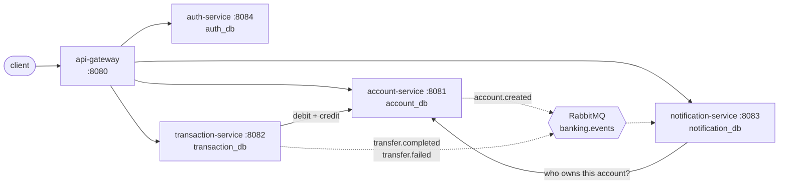
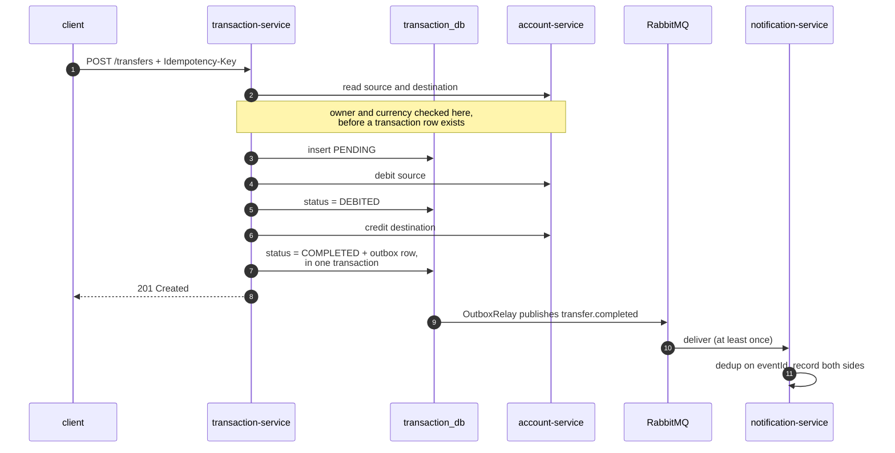
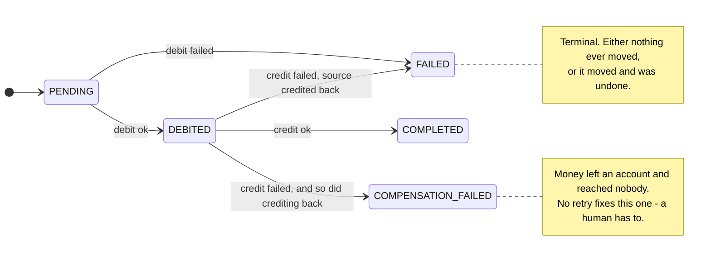

# Banking platform (portfolio project)

[](https://github.com/alejoalbornoz/banking-platform/actions/workflows/ci.yml)

A backend banking system built as a set of independent services (SOA),
demonstrating real-world challenges in that domain: optimistic-locking
concurrency control, idempotent operations, event-driven communication over
RabbitMQ, distributed tracing, and interface-driven, test-covered service
design.



Solid arrows are synchronous HTTP, dashed ones are events. Each service owns
its own database and never reaches into another's. The two synchronous
service-to-service calls both carry a service credential rather than a user's
token, for reasons the [Authentication](#authentication-auth-service-api-gateway)
section gets into. Not drawn, to keep the picture readable: all three
services on the right validate tokens against auth-service's published JWK
set, and Zipkin collects traces from every one of them.

**The parts worth reading**, if you're here to see how something was
approached rather than to run it:

| | |
|---|---|
| [Concurrency](#how-concurrency-is-handled-account-service) | Optimistic locking, and retrying against current state instead of resubmitting a stale write |
| [The ledger](#the-ledger-and-why-creditdebit-are-idempotent) | Why a unique constraint - not a lookup - is what makes credit and debit idempotent, and which of two similar-looking hazards each one actually solves |
| [The transfer saga](#how-a-transfer-works-transaction-service) | Two accounts, two services, no distributed transaction: compensation, crash recovery, and why the saga is deliberately not one big `@Transactional` |
| [Money that gets stuck](#when-the-compensation-itself-fails) | The one outcome nothing can fix automatically, and what it takes for that to reach a human |
| [The outbox pattern](#reliable-events-the-outbox-pattern-transaction-service) | Committing and publishing are two systems; crash between them and they disagree forever |
| [Idempotent consumption](#consuming-idempotently-and-dead-lettering-what-cant-be-handled-notification-service) | The same constraint trick on the consumer side, plus dead-lettering what can never be processed |
| [Authentication](#authentication-auth-service-api-gateway) | RS256 and a published JWK set, and why crediting a transfer's destination can never pass an ownership check |
| [Refresh tokens](#refresh-tokens-rotation-and-detecting-theft) | How rotation turns a stolen token from undetectable into self-announcing, and why the revocation needs its own transaction |
| [Login throttling](#throttling-the-front-door-without-handing-out-a-new-attack) | Why lockout is a worse attack than the one it prevents, and how a throttle can accidentally become the user-enumeration oracle it sits next to |
| [Pagination](#paginating-the-lists-all-three-services) | Why a cursor and not an offset, and the reconciliation check that paginating a statement quietly turns into a lie |
| [Integration tests](#integration-tests) | Four bugs that unit tests couldn't have caught, and exactly why each one was invisible |
| [Known gaps](#known-gaps) | What isn't solved, and which of those were deliberate |

## Stack

- Java 21, Spring Boot 3.3
- PostgreSQL (database-per-service), Flyway migrations
- RabbitMQ for async, event-driven communication between services
- Spring Security (OAuth2 resource server) + Spring Cloud Gateway for JWT-based auth and routing
- Micrometer Tracing + Zipkin for distributed tracing
- JUnit 5 + Mockito for testing
- Docker Compose for local infrastructure

## Project layout conventions

- Interfaces are named `I<Name>` (`IAccountService`, `IAccountRepository`, `IAccountMapper`, `IAccountEventPublisher`); the implementation takes the plain name (`AccountService`, `AccountMapper`, `AccountEventPublisher`) and lives in the same package - no `impl` subpackage.
- Entities live in `model` (not `domain`).
- Each service owns its exceptions and DTOs under its own `exception`/`dto` packages. `common` is intentionally minimal: it only holds event payload contracts (`AccountCreatedEvent`, `TransferCompletedEvent`, `TransferFailedEvent`, `DomainEvent`), since those genuinely must be identical between a publisher and its consumers. Everything else is duplicated per service on purpose, to keep each service independently deployable and readable on its own.
- That rule is why `KeysetPage`/`PageResponse` exist three times rather than in `common`, which is the one duplication here a reviewer is most likely to stop on. The test is whether two services must *agree* on a type, and they don't: a cursor minted by account-service is only ever handed back to account-service, so nothing breaks if the two drift. Event payloads fail that test, which is exactly why they live in `common` and this doesn't.

## Services

| Service | Port | Database | Responsibility |
|---|---|---|---|
| `api-gateway` | 8080 | - | Single entry point, path-based routing, aggregated Swagger UI |
| `account-service` | 8081 | `account_db` | Accounts, balances, ledger. Source of truth for how much money exists. |
| `transaction-service` | 8082 | `transaction_db` | Transfers between accounts: idempotency keys, saga + compensation, outbox pattern |
| `notification-service` | 8083 | `notification_db` | Consumes account/transfer events off RabbitMQ, idempotently records notifications |
| `auth-service` | 8084 | `auth_db` | User registration/login, JWT issuance, JWKS publishing |

## Running the whole thing

```bash
docker compose up --build --wait
```

That builds all five services and starts them alongside Postgres, RabbitMQ,
and Zipkin. `--wait` returns once every container reports healthy, so when
the command finishes the platform is actually ready to take requests - go
straight to "Trying the API" below, on port 8080.

- API gateway on `8080` - the only port a client needs, and where the
  Swagger UI for all four services lives (http://localhost:8080/swagger-ui.html)
- Postgres on `5432` (databases `account_db`, `transaction_db`,
  `notification_db`, `auth_db` are pre-created)
- RabbitMQ on `5672` (management UI at http://localhost:15672, `banking`/`banking`)
- Zipkin on `9411` (UI at http://localhost:9411)

The services are also published individually on `8081`-`8084`, which is
useful for looking at one service's `/actuator` directly, though normal
traffic has no reason to bypass the gateway.

All five build from the same root `Dockerfile`, selected by a `MODULE` build
arg. The build stage is identical for each, so Docker runs the Maven build
once and the other four reuse that layer instead of compiling the same
reactor five times.

## Running a single service from source

For working on one service, running it from Maven against the containerised
infrastructure is faster than rebuilding an image each time:

```bash
docker compose up -d postgres rabbitmq zipkin
```
```bash
mvn clean install
```
```bash
mvn -pl account-service spring-boot:run
```

Every host in the config defaults to `localhost` (`${POSTGRES_HOST:localhost}`
and friends), and Compose overrides those with service names when the
services run as containers - so the same `application.yml` works both ways
with nothing to switch. A service started from Maven talks to the
containerised ones over the published ports without any extra setup.

Start `auth-service` first if you're running several by hand: the others
fetch its public key set the first time they validate a token.

## Trying the API

**http://localhost:8080/swagger-ui.html** is the quickest way in: one Swagger
UI with a dropdown for all four services, served through the gateway so the
browser only ever talks to one origin. Log in via auth-service's
`POST /api/v1/auth/login`, paste the token into the Authorize button, and the
other three services are callable from the page.

Each service also serves its own document at `/v3/api-docs` on its own port,
which is what the aggregated page fetches. Those paths are deliberately left
open in each `SecurityConfig`: the shape of an API isn't the secret, the data
behind it is, and every endpoint described there still demands a token.

The curl walkthrough below covers the same ground. Everything goes through
the gateway on port 8080, and (`auth-service`'s own endpoints aside) needs an
`Authorization: Bearer <token>` header - every other service validates it.

### auth-service: register and log in

```bash
curl -X POST localhost:8080/api/v1/auth/register \
  -H "Content-Type: application/json" \
  -d '{"email":"alice@example.com","password":"password123"}'

# Returns BOTH an accessToken (15 min, used on every call below) and a
# refreshToken (30 days). Copy both.
curl -X POST localhost:8080/api/v1/auth/login \
  -H "Content-Type: application/json" \
  -d '{"email":"alice@example.com","password":"password123"}'

# When the access token expires, trade the refresh token for a new pair.
# The one you send is consumed - store the new one, because sending the old
# one again is read as theft and kills the whole session. See
# "Refresh tokens" below.
curl -X POST localhost:8080/api/v1/auth/refresh \
  -H "Content-Type: application/json" \
  -d '{"refreshToken":"{refreshToken}"}'

# End the session. 204 whether or not the token was recognised.
curl -X POST localhost:8080/api/v1/auth/logout \
  -H "Content-Type: application/json" \
  -d '{"refreshToken":"{refreshToken}"}'
```

Try sending the *same* `refreshToken` to `/refresh` twice: the second call
gets `401`, and so does the token the first call handed you - a replayed
token is treated as a stolen one, and the whole family goes.

And try getting a password wrong seven times in a row: the first six come
back `401`, then it turns into `429` with a `Retry-After`, and the *correct*
password gets 429 too until the delay elapses - nothing is checked while an
address is held off. An address you never registered behaves identically, on
purpose; see "Throttling the front door" below.

### account-service

`ownerId` is never in the request - it's taken from the token, so the account
you create always belongs to whoever's logged in:

```bash
# Create an account
curl -X POST localhost:8080/api/v1/accounts \
  -H "Content-Type: application/json" \
  -H "Authorization: Bearer {token}" \
  -d '{"openingBalance":100.00,"currency":"USD"}'

# Fetch it (replace {id} with the id returned above) - 403 if it isn't yours
curl localhost:8080/api/v1/accounts/{id} -H "Authorization: Bearer {token}"

# List your own accounts
curl localhost:8080/api/v1/accounts -H "Authorization: Bearer {token}"

# Read the statement. The balance is recomputed over the WHOLE ledger even
# though only one page of entries comes back - see "Paginating the lists".
curl "localhost:8080/api/v1/accounts/{id}/ledger?limit=5" -H "Authorization: Bearer {token}"

# Next page: send back the nextCursor the previous response returned.
# Keep going while nextCursor is non-null.
curl "localhost:8080/api/v1/accounts/{id}/ledger?limit=5&cursor={nextCursor}" \
  -H "Authorization: Bearer {token}"

# Close your own account. Refused with a non-zero balance.
curl -X POST localhost:8080/api/v1/accounts/{id}/close -H "Authorization: Bearer {token}"
```

`POST /credit` and `/debit` still exist, but they're `ROLE_SERVICE`-only now -
calling them with a user token gets a 403. Move money via a transfer instead;
see "Authentication" below for why crediting an account you don't own can
never pass an ownership check, and how transaction-service gets around it.

#### The account lifecycle

`ACTIVE → FROZEN` and back, and `→ CLOSED` once, from either. What each state
means is enforced on the account itself rather than by its callers: a frozen
account still *receives* money and simply can't send it, and a closed one does
neither.

**Who may do which is deliberately asymmetric.** Freezing and reactivating
(`POST /{id}/freeze`, `/{id}/reactivate`) require `ROLE_SERVICE`, because a
freeze is a compliance or operations action taken *about* an account holder -
one who could lift their own freeze isn't frozen. Closing (`POST /{id}/close`)
is the holder's own decision about their own account, so it's authorized by
ownership like the reads.

**Closing is final**, and refuses a non-zero balance: money in a closed
account would be stranded, since it can be neither debited nor credited
afterwards. Reactivating a closed account is refused rather than silently
undoing a deliberate, terminal decision.

None of the three takes an `Idempotency-Key`, unlike credit and debit. They
ask for a *state* rather than for a change, so repeating one lands in the same
place - there is no second application to guard against.

### transaction-service

Create two accounts (as two different users, or reuse one for both sides
except source/destination can't match) then transfer between them. Both the
`Idempotency-Key` header and owning the source account are required:

```bash
curl -X POST localhost:8080/api/v1/transfers \
  -H "Content-Type: application/json" \
  -H "Authorization: Bearer {token}" \
  -H "Idempotency-Key: 3f9a1c7e-0001-4a2b-9c3d-000000000001" \
  -d '{"sourceAccountId":"{sourceId}","destinationAccountId":"{destId}","amount":25.00,"currency":"USD"}'
```

Send that exact command a second time and the money moves **once**: the second
call replays the stored result instead of transferring again. Change the amount
but keep the same key and you get `409 IDEMPOTENCY_KEY_REUSED`. Try it with a
`sourceAccountId` you don't own and you get `403 FORBIDDEN` before anything
happens.

```bash
# Look up a transfer's final state (you must own the source or destination)
curl localhost:8080/api/v1/transfers/{transactionId} -H "Authorization: Bearer {token}"

# Your own transfer history: the ones you sent, newest first, paginated.
# Money you received shows up in the ledger and in notifications instead -
# see "Your own transfers" below for why.
curl "localhost:8080/api/v1/transfers?limit=10" -H "Authorization: Bearer {token}"
```

Traces for these requests show up in the Zipkin UI at http://localhost:9411 -
a transfer produces one trace spanning both services.

### notification-service

Nothing to call directly - it only listens. Create an account or run a
transfer above, then check what it recorded (403 if `accountId` isn't yours):

```bash
curl "localhost:8080/api/v1/notifications?accountId={accountId}&limit=10" \
  -H "Authorization: Bearer {token}"
```

A completed transfer produces two rows: one for the sender (`TRANSFER_SENT`)
and one for the receiver (`TRANSFER_RECEIVED`), each queryable by their own
account id. Like every list here it comes back as `{ items, nextCursor }`;
the ownership check runs on every page, not just the first, so a cursor for
someone else's account is still a 403.

## How concurrency is handled (account-service)

`Account.version` is a JPA `@Version` field, so every `UPDATE` includes
`WHERE id = ? AND version = ?`. If two requests read the same account and
both try to commit a change, the second one's `UPDATE` affects zero rows and
Hibernate raises an optimistic-locking exception.

Rather than let that bubble up as a hard failure, `AccountService` wraps
every credit/debit in a `RetryTemplate` (see `RetryConfig`): each retry
attempt opens a **new** transaction via `TransactionTemplate` and re-reads
the account, so it's retrying against the current state, not blindly
resubmitting a stale write. After 3 failed attempts it gives up and surfaces
a `ConcurrentUpdateException` (HTTP 409) for the caller to retry at the
request level.

This is deliberately optimistic locking rather than pessimistic (`SELECT ...
FOR UPDATE`): most concurrent operations touch different accounts, so paying
the cost of a held row lock on every single write doesn't pay off.

## The ledger, and why credit/debit are idempotent

`accounts.balance` is a running total kept for fast reads. The truth behind it
is `ledger_entries`: one immutable, append-only posting per balance change,
written **in the same transaction** as the change itself. Correcting a mistake
means posting an opposing entry, never editing history.

Every credit and debit carries a caller-supplied `Idempotency-Key`, stored on
the entry as its `operation_key` with a `UNIQUE (account_id, operation_key)`
constraint. That constraint is doing the real work, and it's worth being
precise about which hazard it solves, because two very different ones look
similar:

- **Two *different* operations on one account** race on the `@Version` column.
  The loser is safe to redo, so it's retried in a fresh transaction against
  the winner's state. Both end up applied.
- **The *same* operation submitted twice** - a client retry, or a call that
  timed out after it had actually committed - must *not* be redone. Optimistic
  locking is no help here: both writes are individually valid, and the second
  would move money again. The unique constraint is what stops it.

The service looks the key up first, which covers the ordinary case where the
original call committed some time ago. For genuinely simultaneous duplicates -
both look, both find nothing, both insert - only the database can arbitrate,
so the loser catches the constraint violation and **replays the winner's
outcome instead of treating it as an error**. Same key with a *different*
amount is refused (`409 OPERATION_KEY_REUSED`): replaying it would silently do
something other than what the caller asked, and applying it would break the
promise the key makes.

The key is scoped per account rather than globally, because one transfer
legitimately posts to two accounts and those postings must not collide with
each other.

Because each entry also stores `balance_after`, the balance can be re-derived
and checked at any time. `GET /api/v1/accounts/{id}/ledger` does exactly that
and returns `reconciled`, so a broken invariant surfaces as a visible flag
rather than as quietly wrong money.

**This is what makes the transfer saga safe.** transaction-service derives a
stable key per leg from its own transaction id (`<txId>:debit`,
`<txId>:credit`, `<txId>:compensation`) rather than generating one per attempt
- a fresh UUID each time would make every retry look like a brand new
operation, which is precisely how double-spending happens. Because the key is
derived from durable state, even a retry from a different process after a
crash recomputes the identical key.

## How a transfer works (transaction-service)

A transfer has to debit one account and credit another, in a different
service, over HTTP. There is no distributed transaction to lean on, so it's
run as a **saga with one compensating action**, tracked by a row whose status
is the saga's state machine.

Before any of that starts, `TransferService` fetches both accounts (via
account-service, using its own service credential) and checks two things:
that the caller owns the source account (see "Authentication"), and that
**both accounts' currency matches the transfer's requested currency** - a USD
transfer can't touch a EUR account, and this project doesn't do FX
conversion. Neither check depends on anything that changes over time (an
account's owner and currency are both fixed at creation), so a mismatch is
rejected with `400 CURRENCY_MISMATCH` before a transaction row is ever
created - unlike insufficient funds, which is a saga *outcome* since the
balance it depends on can genuinely change between attempts.

Here is the whole happy path, end to end. Note how the database writes and
the HTTP calls interleave rather than nest - that's the third point below,
and it's the shape of the diagram itself:



Every branch that path can take, including the one it can't recover from:



Three things make this safe:

**Idempotency.** Every transfer carries a client-supplied `Idempotency-Key`
with a unique constraint on the column. A retry with the same key finds the
existing row and replays its result instead of moving money twice. If two
concurrent requests race to insert the same key, the loser catches the
constraint violation and reads back the winner's row rather than failing.
A key reused with *different* request contents is rejected outright (409) -
it's ambiguous which transfer the client wants, so guessing would be worse
than refusing.

**Crash recovery.** Because the status is persisted between steps, a retry of
a transfer that died mid-saga resumes rather than restarts: a `DEBITED` row
means the debit already committed, so the retry picks up at the credit step
instead of debiting a second time.

**No open transaction across a network call.** The saga method is deliberately
*not* one big `@Transactional`. Each database write is its own short
transaction via `TransactionTemplate`, with the HTTP calls happening in
between - holding a DB connection (and possibly row locks) open for the
duration of another service's call, retries included, is how connection pools
die.

### When the compensation itself fails

Every other outcome above is *handled*: the money either moved or it didn't,
and the status says which. `COMPENSATION_FAILED` is the one that isn't - the
debit committed, the credit failed, and crediting the source back failed too,
so money has left an account and reached nobody. No retry fixes that; a human
has to.

So that's the one path that raises an alert rather than only recording an
outcome. `StuckTransferAlerter` increments a Micrometer counter
(`banking.transfers.stuck`, exposed at `/actuator/metrics/banking.transfers.stuck`
and `/actuator/prometheus`) and writes an ERROR log line carrying both
failure reasons under an `OPS_ALERT` marker. The counter is what actually
pages someone: its correct value is permanently zero, so the alert rule is
"any increase at all", and the metric is deliberately **untagged** - tagging
by transaction id would give a monitoring backend one new time series per
incident, which is how cardinality explosions happen. Identifiers live in the
log line and in `GET /api/v1/transfers/stuck`, which lists everything
currently stuck (`ROLE_SERVICE`-only, since it spans every user's transfers)
and answers the question a log line can't: *is anything stuck right now.*

Two ordering details matter. The alert fires **before** the
`COMPENSATION_FAILED` row is written, because the money is already stuck by
that point regardless of whether the write succeeds - alerting afterwards
would make the worst case (stuck money *and* no record of it) the silent one.
And a failure in the alerting channel is caught and logged rather than
propagated, so an unreachable pager can never cost us the database record.
That matters because `IStuckTransferAlerter` exists precisely as a seam:
swapping the log-and-metric implementation for a real pager, a Slack webhook,
or an incident API is implementing one method, and that implementation would
make network calls.

## Reliable events: the outbox pattern (transaction-service)

Committing to the database and publishing to RabbitMQ are two separate
systems; crash between them and they disagree forever. account-service
currently publishes `AccountCreatedEvent` after commit via a transaction
synchronization, which closes the rollback hole but not the crash hole -
acceptable for a welcome notification.

transaction-service can't accept that, so it uses the outbox pattern:

1. `TransferService` writes the event as a row in `outbox_events` **in the
   same local transaction** as the status change that caused it. Same
   database, so it's genuinely atomic - the event and the state can never
   disagree.
2. `OutboxRelay` polls for unpublished rows and publishes them to RabbitMQ,
   marking each published in its own transaction. If the broker is down, the
   transaction rolls back, the row stays unpublished, and the next poll tries
   again. A broker outage delays events; it never loses them.

The trade-off is at-least-once delivery: the relay can crash after publishing
but before marking the row, so consumers must deduplicate on `eventId`. That
is why `DomainEvent` carries one.

Polling is the simple implementation, which is the right call at this scale.
Production systems at high throughput usually switch to change-data-capture
(Debezium tailing the WAL) to avoid constantly `SELECT`ing the table.

## Consuming idempotently, and dead-lettering what can't be handled (notification-service)

Everything above guarantees an event gets published at least once. It says
nothing about how many times a consumer *acts* on it - and "at least once
delivery" plus "act on every delivery" is exactly how you'd double-notify (or,
in a less forgiving handler, double-charge) someone. notification-service is
where that risk actually lands, so it closes the loop the same way
account-service's ledger closes it on the producer side: a unique constraint,
not a check-then-act.

Every event this service has ever handled gets one row in `processed_events`,
keyed by the event's own `eventId` - not a generated one. Handling an event
means, in one transaction: insert that row, then create whatever
notifications the event implies. If the row already exists (a redelivery),
the insert fails, the transaction rolls back, and the whole thing is treated
as a no-op rather than an error. One event can produce more than one
notification - a completed transfer notifies both the sender
(`TRANSFER_SENT`) and the receiver (`TRANSFER_RECEIVED`) - but
`processed_events` is what makes sure that pair is only ever created once no
matter how many times the message shows up.

That "the insert fails" step needed one non-obvious thing to actually be
true. `ProcessedEvent`'s id is *assigned* (it's the event's own id, which is
the whole point), and Spring Data decides between `persist` and `merge` by
asking whether an entity is new - its default answer for a non-null assigned
id being "not new". So `save` issued a `merge`, which on a redelivery found
the existing row and quietly UPDATEd it: no constraint violation, no
exception, and a second notification created every time. The constraint was
never doing the work this design assumed it was. `ProcessedEvent` now
implements `Persistable` and reports itself as always new, which forces the
INSERT the deduplication depends on.

This only works because `AccountCreatedEvent`, `TransferCompletedEvent`, and
`TransferFailedEvent` can be faithfully reconstructed from JSON, `eventId`
included. That wasn't true until this service needed it: each event class had
exactly one public constructor, and it always minted a fresh `eventId` -
correct for a publisher creating a new event, silently wrong for a consumer
reconstructing one, since every redelivery would get a different id and
"deduplicate by eventId" would never fire. Each class now has a second,
`@JsonCreator`-annotated constructor for exactly that reconstruction.

**Dispatch is by routing key, not by a type header.** account-service
publishes via `Jackson2JsonMessageConverter`, which stamps a `__TypeId__`
header naming its Java class; transaction-service's outbox relay sends
pre-serialized JSON as raw bytes with no such header at all (a converter there
would double-encode an already-serialized string). A consumer trusting that
header would work against one publisher and break against the other, so
`BankingEventListener` ignores it entirely and picks the target class from the
routing key instead - the one thing both publishers reliably set.

**A message this consumer can never process must not loop forever.**
`notification-service.events.queue` is declared with `x-dead-letter-exchange`
pointing at a fanout `banking.events.dlx`. The listener container retries a
failing delivery a few times locally (fast, in-process, no broker round trip),
and once those are exhausted, `RejectAndDontRequeueRecoverer` rejects the
message without requeueing it - which, because of that queue argument, routes
it to the dead-letter queue instead of either looping on this queue forever or
disappearing silently.

## Authentication (auth-service, api-gateway)

Every endpoint used to be open, and `ownerId` was trusted straight from the
request body - anyone who knew (or guessed) an account's UUID could read its
balance, credit it, or debit it. `auth-service` and per-service Spring
Security resource-server config close that.

**RS256 + JWKS, not a shared secret.** `auth-service` generates a 2048-bit RSA
keypair once at startup and publishes the public half at
`GET /.well-known/jwks.json`. account-service, transaction-service, and
notification-service each point `spring.security.oauth2.resourceserver.jwt.jwk-set-uri`
there and validate every token's signature against it - no secret is ever
copied into more than one service's config, unlike the shared `banking`/
`banking` Postgres and RabbitMQ credentials this project otherwise uses for
simplicity. The keypair is **ephemeral, generated fresh on every restart** -
a deliberate simplification for a portfolio project, not an oversight.
Restarting auth-service invalidates every token issued by the previous
instance, since the new instance publishes a different public key. A real
deployment would persist the keypair (a KMS, a mounted secret) so a restart
doesn't log everyone out.

**Two kinds of token, one claim that tells them apart.** Logging in mints a
token with `sub` = the user's id and `role=USER`. `POST /api/v1/auth/service-token`
(client-id/secret from config - `banking.security.service-clients` in
auth-service's `application.yml` - not the `users` table, since a service
credential isn't a human account) mints one with `role=SERVICE` instead. Every
resource server maps that claim to a `ROLE_*` Spring Security authority via a
small custom `JwtAuthenticationConverter` (the claim is a plain string, not
the space-delimited `scope`/`scp` list Spring Security's default converter
expects).

**Registration splits the work the same way the ledger does.** `register`
looks the address up first, which covers the ordinary "that email is taken"
case cleanly. But two simultaneous registrations of the same address both
see it as free and both insert, and no amount of looking first fixes that -
so the `unique (email)` constraint arbitrates, and the loser's violation is
translated into the same `409 EMAIL_ALREADY_EXISTS` the lookup would have
produced rather than escaping as a 500.

**Why account-service needs a service role at all.** A transfer credits the
*destination* account, which by definition doesn't belong to whoever
initiated the transfer - "does the caller own this account" can never be the
right check for that call. So `account-service`'s `/credit` and `/debit` are
`ROLE_SERVICE`-only, not reachable by an end user at all any more; only
transaction-service calls them, using a service token it obtains once from
auth-service and caches (`ServiceTokenProvider`), attached to every outgoing
call via a `RestClient` request interceptor
(`RestClientConfig.accountServiceRestClient`). That same token lets
transaction-service call `GET /accounts/{id}` to look up who owns an account
before initiating or returning a transfer - the one case where a
service-role caller legitimately needs to read *any* account, not just its
own.

**Everywhere else, ownership is checked in the controller or service layer,
not the URL pattern.** `GET /accounts/{id}`, `/accounts/number/{n}`, and
`/ledger` all fetch the account first, then compare its `ownerId` to the
caller's JWT `sub` (or accept a `ROLE_SERVICE` caller) - a route-matching
rule has no way to know who owns a specific row before it's read.
`transaction-service` follows the same pattern for `/transfers`: it fetches
the source account's owner via its service token and rejects the request
before the saga ever starts if the caller isn't it. `notification-service`
does the same for `GET /notifications?accountId=` - it has its own
`ServiceTokenProvider` and `IAccountClient`, a near-identical copy of
transaction-service's, since checking "does the caller own this account"
inherently means asking account-service, and there was no way around
duplicating that machinery a second time.

**`api-gateway` is pure routing.** It doesn't validate JWTs itself - each of
the four services behind it is already a proper resource server, so a second
check at the gateway would just duplicate the same validation against the
same JWKS, not add a real second line of defense. It only exists so a client
has one base URL and port (8080) instead of four.

### Refresh tokens: rotation, and detecting theft

An access token cannot be revoked. That is not a shortcoming of this
implementation, it is what makes it fast: every service validates it offline
against the JWK set and never asks auth-service anything. The price is that a
leaked one stays good until it expires, and the only lever is to expire it
soon — which was why user tokens lasted an hour and there was nothing else
holding a session together.

Now a login returns two things:

```json
{ "accessToken": "eyJ...", "expiresInSeconds": 900,
  "refreshToken": "F3n...", "refreshExpiresInSeconds": 2592000 }
```

The access token is down to **15 minutes**, because the session's real length
is now the refresh token's 30 days — and unlike the access token, that one
lives in a database row and *can* be taken away.

**The refresh token is opaque, not a JWT.** A credential that must be
revocable gains nothing from being self-describing: you have to look it up to
know whether it is still good, and once you are looking it up, the signature
was never doing any work. It is 256 bits of `SecureRandom`, base64url.

**Only its SHA-256 is stored.** A dump of `refresh_tokens` must not be a dump
of live sessions. SHA-256 rather than bcrypt, for two reasons: bcrypt's work
factor exists to slow brute force against guessable human passwords, and there
is nothing to guess in 256 random bits — but the decisive one is that bcrypt
salts every hash, and a salted hash cannot be *looked up*, only compared
against one row at a time. The unsalted digest is what lets the presented
token find its row in a single indexed hit.

**Every exchange rotates.** `POST /api/v1/auth/refresh` consumes the token it
was given and issues a new one in the same **family** — the set of tokens
descended from one login.

```
login ──▶ token A ──refresh──▶ token B ──refresh──▶ token C      (one family)
                     A spent              B spent
```

That is the part that turns a stolen token from undetectable into
self-announcing. An honest client can only ever use a given refresh token
once, because it replaced it the first time. So a **second** use means two
parties hold the same token, and one of them stole it. Which one is calling
right now is unknowable — the thief may be racing ahead of the victim, or
replaying behind them — so the only safe answer is to distrust the whole
family and make everyone log in again:

```
attacker steals token A, client refreshes first ──▶ B issued, A spent
attacker presents A            ──▶ 401, and the entire family is revoked
client later presents B        ──▶ 401 as well
```

Both are locked out, which is the intended outcome. Compare the alternative
it replaces: without rotation, a stolen refresh token is a silent, renewable,
permanent session and nothing ever reveals it.

**The detection is not an `if`.** There is no "has this been used?" read
anywhere in `refresh`, on purpose — that would be check-then-act, and two
requests presenting the same token would both read *no* and both proceed. It
is a conditional UPDATE, the same division of labour as account-service's
ledger constraint:

```sql
UPDATE refresh_tokens SET used_at = :now
 WHERE id = :id AND used_at IS NULL AND revoked_at IS NULL
```

Zero rows updated means somebody else already consumed it. The database is
the only participant that can arbitrate a race the caller is part of.

**Revocation has to outlive the failure that triggers it.** `refresh` is
`@Transactional` and the reuse path ends by throwing, so a revocation
enlisted in that same transaction would be rolled back along with it — the
compromised family left live, and the attack unrecorded. It runs in a
`REQUIRES_NEW` transaction instead, so it commits on its own. This is the kind
of bug that only appears in production, months later, as "we log these and
they never seem to take effect."

**Expired is not the same as reused.** An expired token is the mechanism
working, so it is rejected without touching the family. Coming back after a
month away must not look identical to a theft.

**What it costs, stated plainly.** A client that fires two refreshes
concurrently with the same token trips this and gets logged out, with nothing
stolen. Real deployments often soften that with a short grace window in which
the immediately-preceding token is accepted once more. That is a deliberate
trade of security for convenience and this project takes the strict side: a
false logout costs a login, a missed detection costs the account.

**`POST /api/v1/auth/logout`** revokes the family and returns `204` whether or
not the token was recognised — an endpoint that answered "unknown token" would
be an oracle for confirming which guesses are real. It is idempotent for the
same reason the account lifecycle endpoints are: it asks for a state, not a
change. Each login starts its own family, so signing out of a laptop leaves
the phone signed in.

**Service tokens get no refresh token at all** (the field is absent from the
JSON, not null). A service holds its own client-id/secret and can ask for
another token whenever it likes, so a second long-lived credential to store
and rotate would add risk and buy nothing.

### Throttling the front door, without handing out a new attack

All that care over tokens is worth very little if `/login` accepts unlimited
guesses, which it did. Two separate problems, and the interesting part of each
is what the obvious fix gets wrong.

**Backoff, not lockout.** "Lock the account after five failures" trades one
attack for a cheaper one: knowing somebody's email address becomes enough to
keep *them* out of their own account, indefinitely, for free. So the delay
doubles instead — 5 free attempts, then 2s, 4s, 8s, up to a 15-minute cap.
Guessing is hopeless long before the numbers get large, a person who
fat-fingers their password twice never learns this exists, and waiting is
always enough to get back in.

**The delay is derived, never stored.** There is no `locked_until` column and
nothing to unlock. `failed_count` and `last_failure_at` are enough to say how
long an address is held off *right now*, so the delay expires by itself. That
sidesteps the classic failure mode of lockout tables — the row that never got
unlocked because the job that was supposed to unlock it stopped running.

**The throttle counts addresses, not accounts — and that is the whole point.**
Counting only registered addresses would have made the throttle answer the
exact question `InvalidCredentialsException` is so careful never to answer.
"Five tries then a delay" versus "unlimited tries" is a perfectly good user
-enumeration oracle, and it would have quietly undone the identical-error-
message design sitting right next to it. An address nobody ever registered is
throttled identically.

**The counter is advanced by an upsert, not by reading it and writing it
back.** Same reasoning as the ledger and as refresh-token consumption: a burst
of simultaneous guesses would all read the same count before any of them
wrote, and twenty attempts would be recorded as one — which is precisely the
shape an attacker would use.

```sql
INSERT INTO login_attempts (email, failed_count, last_failure_at)
VALUES (:email, 1, :now)
ON CONFLICT (email) DO UPDATE
   SET failed_count = CASE WHEN login_attempts.last_failure_at < :resetBefore
                           THEN 1 ELSE login_attempts.failed_count + 1 END,
       last_failure_at = :now
```

The `CASE` is the decay, in the same statement so that resetting is atomic
too. And recording a failure runs in its own `REQUIRES_NEW` transaction,
because `login` is `@Transactional` and a failed login ends by throwing — a
counter that rolls back every time it counts something is not a counter. That
is the same trap as the refresh-token revocation above, and it is worth
noticing that it appeared twice in one service.

**The other hole was on the clock.** `login` already returned one
indistinguishable error for "no such address" and "wrong password". But an
unknown address returned *before any hashing at all*, while a known one
returned after a full bcrypt — about 100ms apart. That gap is a usable
user-enumeration oracle that needs no repeated attempts and no throttle to
evade, just a stopwatch. An unknown address is now compared against a decoy
hash it cannot match, so both paths cost the same. The decoy is generated at
startup from the configured encoder rather than hardcoded, since a decoy
produced by a different algorithm than the real hashes would take a different
amount of time and give the game away.

`AuthServiceTest` asserts the two paths stay within the same order of
magnitude of each other rather than pinning absolute numbers, since bcrypt's
cost depends on the machine.

**What this deliberately does not cover:** an attack spread thinly across many
addresses, or one address attacked from thousands of hosts. Both want a
per-IP limit at the edge, which needs shared state at the gateway and a
decision about how far to trust `X-Forwarded-For` — a header the client
controls unless something upstream overwrites it. See "Known gaps".

Rotation writes a row per refresh, so `RefreshTokenCleanup` deletes rows a
week past expiry on a schedule — a table that grows with *traffic* rather
than with users is fine for a year and then is not. The week of retention is
deliberate: a token deleted the instant it expires comes back as *unknown*,
indistinguishable from one that never existed, which is a worse story in the
logs when someone is investigating.

## Paginating the lists (all three services)

Every list endpoint a user can reach returns a page, never a bare array (the
one exception, `/transfers/stuck`, is ops-only and explained at the end):

```json
{ "items": [ ... ], "nextCursor": "MjAyNi0wOS0wOFQxMjowMDowMFp8..." }
```

A client pages by sending the previous response's `nextCursor` back as
`?cursor=`, and stops when it comes back `null`. `?limit=` defaults to 20 and
is **clamped** to 100 rather than rejected - a caller asking for more than we
serve gets the most we will serve, and the cap is what stops `?limit=1000000`
from being an unbounded read wearing a page's clothes.

**Keyset, not offset.** These lists are append-only and sorted newest-first,
so rows keep arriving at the front while a client reads. Under `OFFSET 20`
that shifts the whole window: a row inserted between two requests pushes one
the client already saw down into the next page, and it comes back twice. A
cursor asks for what comes after *one specific row*, which no concurrent
insert can change the meaning of. Offset also degrades as it grows - the
database still walks and discards every skipped row - while a keyset is one
index seek at any depth.

**The sort key is `(created_at, id)`, not `created_at`.** Two rows can share a
timestamp; two ledger entries posted in the same microsecond is not a
hypothetical. A cursor pointing at a position several rows occupy can't say
which of them was already returned, so the id breaks the tie - which is why
each supporting index carries both columns (`V3` in account-service, `V2` in
the other two).

Two details that are easy to get wrong, both covered by `KeysetPageTest`:

- **The query fetches `limit + 1` rows.** That extra row is never returned; it
  only answers "is there another page?" without a second `COUNT` over the
  table. Without it, a final page that happens to be exactly full is
  indistinguishable from one with more behind it, and the client is handed a
  cursor that leads to an empty page.
- **The cursor's timestamp comes from a row the database returned**, never
  from an `Instant.now()`. Postgres stores `timestamptz` to microseconds while
  a Java `Instant` carries nanoseconds, so a locally-built timestamp would
  compare unequal to the row it was meant to point at and the tiebreak would
  quietly stop working.

The cursor is base64url so it crosses a query string untouched and reads as
opaque. That opacity is presentation, not security - anyone can decode it. It
is encoded so clients treat it as a token to hand back rather than as a format
to construct, which would freeze the sort key into the public API.

### What paginating the ledger broke

`GET /accounts/{id}/ledger` reports a `computedBalance` next to the stored one
so the response can prove the two reconcile. That balance used to be the sum
of the entries in the response - correct only while the response held *every*
entry. The moment it holds twenty rows out of thousands, the same code is
summing a page and calling it a reconciliation, and every account longer than
one page reports itself as broken.

So the total moved into the database, as its own query over all entries,
while the page fetches only the page. Reconciliation is a claim about the
whole ledger, so it has to be computed over the whole ledger; both run in one
read-only transaction, so the page and the total come from a single consistent
snapshot. `AccountServiceTest` pins this directly - a page holding one 10.00
entry against a ledger totalling 75.00 must still report reconciled.

That move also deleted `LedgerEntry.signedAmount()`: the credit-positive
/debit-negative convention now lives in the SQL `CASE`, and a mocked
repository can't execute it, which is why `AccountIT` re-checks it against a
real Postgres with both directions in the ledger.

### Your own transfers

`GET /api/v1/transfers` is new, and it is scoped by a new `initiated_by`
column rather than by account ownership - the transfers you **sent**, not
every transfer that touched your accounts.

That's a real scoping decision, not an oversight. Ownership lives in
account-service, so deciding it per row means one network call per row, and
pushing the account ids into the query means fetching every account you own
before the first row can be read. `GET /transfers/{id}` can afford that check
because it's one row. A list can't. Money that arrived is already visible
where it landed - in the account's own ledger, and as a `TRANSFER_RECEIVED`
notification.

Transfers created before that column existed have it null and appear in
nobody's history; they stay readable by id. Backfilling was not an option -
this service never recorded who initiated them, and inventing a value would
have been worse than admitting the gap.

`GET /transfers/stuck` stays deliberately unpaginated. Its correct size is
zero, and if it ever returns enough rows for paging to matter, the paging is
not the problem.

## Integration tests

Unit tests use Mockito, which is enough for business logic but structurally
can't exercise a few things that only exist once a real database and broker
are involved: a genuine unique-constraint race under concurrent writers, a
real `@Version` optimistic-lock conflict, whether the Flyway migrations
actually apply cleanly, or whether a JPA mapping matches what Postgres
actually has. Each service has an integration test suite for exactly that -
and in this project's case, that's not hypothetical: running the full stack
live for the first time surfaced a `@Lob`-on-a-TEXT-column mapping mismatch in
`OutboxEvent` and a saga bug where `TransferService` reused a stale `@Version`
across two saves, and unit tests had passed the whole time because a mocked
`save()` just echoes its input instead of behaving like Hibernate's `merge()`.

The third one arrived the first time these actually ran in CI:
`NotificationConsumerIT` failed on a redelivered event producing two
notifications, because `save` on an assigned-id entity merges instead of
inserting and never tripped the primary key (see "Consuming idempotently"
above). The unit test for that path had been green throughout - it mocks the
repository to *throw* the constraint violation, so it proves the catch block
handles one correctly while saying nothing about whether the database ever
raises it. That's the whole category these tests exist for.

The fourth was the cheapest of all to find and the easiest to have shipped:
the `refresh_tokens` migration declared `token_hash` as `CHAR(64)` while the
entity maps a `String`, which Hibernate expects as `varchar`. Eighteen unit
tests passed - they mock the repository, so no schema is involved at any
point - and auth-service then refused to start, because `ddl-auto: validate`
compares the mapping against the real columns. A migration and the entity it
backs are two descriptions of one table, and nothing but a database will tell
you they disagree.

- `account-service`: `AccountIT` - fires N concurrent credit requests at the
  same account, both with the same Idempotency-Key (must post exactly once)
  and with distinct keys (all must apply, none lost to a lost update). It
  also walks the paginated ledger to the last page, because two things there
  exist only in the database: the reconciliation total is a JPQL
  `SUM(CASE ...)` that a mocked repository never executes, and the cursor has
  to survive a round trip through the timestamp precision Postgres actually
  stores.
- `transaction-service`: `TransferSagaIT` - the saga against a real Postgres,
  with only the HTTP call to account-service mocked, covering the happy path,
  the compensation path, and resuming a transfer stuck at `DEBITED`.
- `notification-service`: `NotificationConsumerIT` - publishes real messages
  onto a real exchange and verifies consumption, idempotent redelivery, and
  the retry-then-dead-letter path.
- `auth-service`: `AuthIT` - logs in and then decodes the returned token
  against the JWK set the service itself publishes, which is the one thing
  the unit test can't do at all (it mocks the `JwtEncoder`, so it never
  proves a real RS256 token is produced, let alone that the published key
  verifies it). Also covers concurrent registration of the same address, and
  that the service-client credentials in `application.yml` actually bind.
  Refresh-token family revocation lives here too: the unit test can only
  assert that `revokeFamily` was *called*, while whether that UPDATE really
  reaches the perfectly valid token handed out one call earlier is a claim
  about SQL, and only a database settles it.

These are `*IT.java` classes run by `maven-failsafe-plugin`, gated behind an
`integration-tests` Maven profile that's off by default. `verify` runs before
`install` in Maven's own lifecycle, so binding failsafe unconditionally would
make plain `mvn install` - the routine build command - start a Docker daemon
on every run; the profile keeps that opt-in:

```bash
mvn verify -Pintegration-tests
```

`mvn test` and plain `mvn install` never touch Docker at all, regardless of
this profile.

Each test class spins up its own Postgres and RabbitMQ via Testcontainers;
`@ServiceConnection` wires them into `spring.datasource.*` /
`spring.rabbitmq.*` automatically, no manual property plumbing.

**Known issue: this profile on Windows with Docker Desktop.** On this
project's own dev machine (Docker Desktop 4.82.0), running it fails outright
- docker-java's connection probe gets a malformed, empty `400` response,
whether it's dialed over the Windows named pipe or over Docker Desktop's
"expose daemon on tcp://localhost:2375" option. Both appear to route through
the same internal proxy, which has some incompatibility with the (fairly
old) bundled docker-java client; bumping `<testcontainers.version>` in the
root `pom.xml` didn't resolve it either. Running Maven from *inside* WSL2,
talking to the Linux-native Docker socket directly instead of through Docker
Desktop's Windows-side proxy, should sidestep this entirely, but that needs
its own JDK/Maven install inside the distro and hasn't been tried.

**So CI is where these actually run.** An ubuntu runner has a native
`/var/run/docker.sock` with none of Docker Desktop's proxy layer in the way,
so Testcontainers works there with no configuration at all - which is why the
workflow below runs the profile that this machine can't.

## Continuous integration

`.github/workflows/ci.yml` runs on every push to `main` and every pull
request:

```bash
mvn -B --no-transfer-progress --fail-at-end verify -Pintegration-tests
```

One command covers both layers - surefire runs the unit tests, and only if
they pass does failsafe start the Testcontainers-backed `*IT` classes. The
workflow needs no `services:` block for Postgres or RabbitMQ: the tests bring
their own containers up themselves.

`--fail-at-end` is deliberate: the services don't depend on one another, so
the default fail-fast would stop at the first broken module and leave the
state of the remaining four unknown until the next push. On a failed run the
surefire and failsafe reports are uploaded as an artifact, since the console
output alone usually isn't enough to diagnose a failure you can't reproduce
locally.

**Two plugin bindings this project has to declare that most don't.** Both
come from importing the Spring Boot BOM rather than inheriting
`spring-boot-starter-parent`, which is also why `maven.compiler.parameters`
is set by hand (see the root `pom.xml`):

- The `repackage` execution. Without it the plugin is present but never
  runs, and every module produces a plain jar with no `Main-Class`. That is
  invisible for as long as everything is started with `spring-boot:run`, and
  it surfaced the moment the Docker images tried `java -jar`.
- Failsafe's `classesDirectory`. Adding `repackage` then broke the
  integration tests, because failsafe tests the project's *artifact* and the
  artifact is now a fat jar whose classes sit under `BOOT-INF/classes`. The
  failure mode is worth knowing: not a missing class, but `failed to
  discover tests` and zero tests run - a build that goes red without a
  single integration test having started. Pointing failsafe back at
  `${project.build.outputDirectory}` fixes it.

## Known gaps

Being explicit about what is *not* solved yet, since these are the interesting
parts:

- **Nothing consumes the stuck-transfer alert yet.** The counter and the
  marked log line are emitted (see "When the compensation itself fails"), but
  wiring them to something that actually wakes a person - a Prometheus alert
  rule, a log-based monitor, a pager - is deployment configuration this repo
  doesn't contain. The seam is `IStuckTransferAlerter`; only the last mile is
  missing.
- **The other three services expose `/actuator/prometheus` in config but
  don't ship the registry that serves it.** Only transaction-service has
  `micrometer-registry-prometheus`, added because that's where the alert
  metric lives. The others' exposure line is currently dead config.
- **There is no single "all my movements" view.** `GET /transfers` lists what
  you sent; what you received is in the account ledger and in notifications.
  Assembling one merged, paginated timeline across two services means either
  a read model fed by the existing events or a query service that fans out
  and merges - a real design decision, not a missing endpoint, so it isn't
  faked here with something that only works while the data is small.
- **No per-IP rate limiting at the gateway.** The login throttle counts
  failures per address, which stops someone working through passwords for one
  account but not an attack spread thinly across many addresses, nor one
  address hit from thousands of hosts. That wants a limit at the edge, which
  needs shared state across gateway instances (Redis) and a decision about how
  far to trust `X-Forwarded-For` - a header the client controls unless
  something upstream overwrites it. Neither is a detail worth faking.
- **`/register` is not throttled either.** It is unauthenticated and does a
  bcrypt per call, so it is the same shape of problem; the same counter would
  cover it, keyed the same way.
- **Nothing consumes the refresh-token reuse warning either.** Detecting
  reuse revokes the family and writes a WARN line naming it, which is the
  right thing to have happened - but somebody stealing sessions is exactly
  the event a human should hear about, and this is the same missing last mile
  as the stuck-transfer counter above.
- **An access token still can't be revoked mid-life.** That is inherent to
  validating it offline against the JWK set, and refresh tokens narrow it
  rather than close it: revoking a family stops the session from continuing,
  but an access token already issued stays valid for up to its 15 minutes.
  Closing that properly means introspection or a shared denylist, and both
  trade away the offline validation that makes the current design fast.
- **auth-service's signing key doesn't survive a restart** - see
  "Authentication" above. Fine for a demo, not for anything real.
